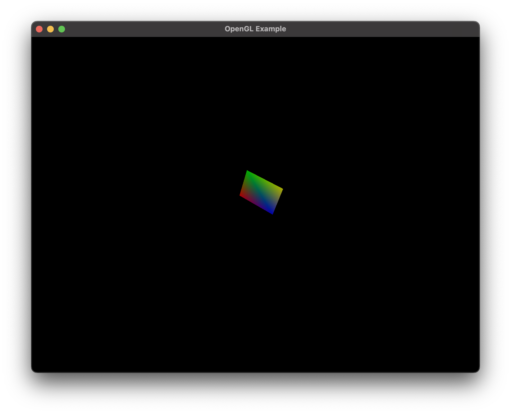
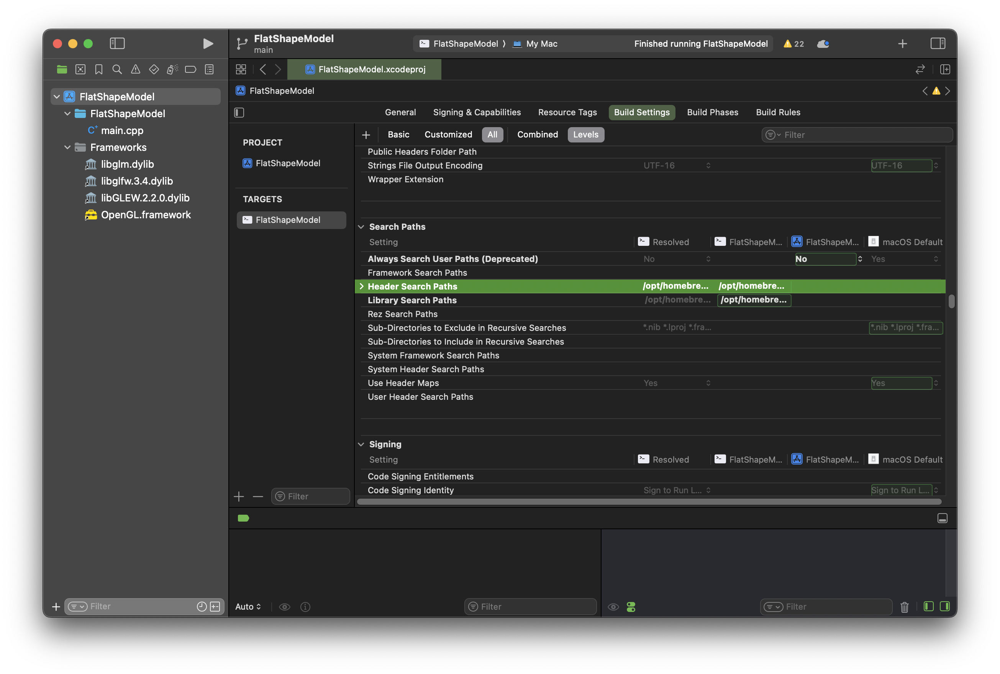

# FlatShapeModel

Flat shape model implemented in OpenGL using Xcode. This project demonstrates an example implementation of a flat shape model of a parallelogram (with one side aligned along the OX axis, z=0), where adjacent vertices have different colors and possess normals. The scene includes a directional light source parallel to the vector {1,1,1}, and the camera is positioned at (20,20,20), facing the origin.



## Prerequisites

Before running the project, make sure you have the following dependencies installed:

- [GLFW](https://www.glfw.org/) (version 3.x)
- [GLEW](http://glew.sourceforge.net/) (version 2.x)
- GLM

To install these libraries using Homebrew, run:

```bash
brew install glfw3
brew install glew
brew install glm
```
If you are trying to run the project from the repository and encounter errors stating that files are not found, simply follow the steps in the Project Configuration section.

# Creating a New Project in Xcode

1. Open Xcode and select Create a new Xcode project.
2. Choose Application -> Command Line Tool, and click Next.
3. Set the Language to C++, and provide a name for your project.
4. Click Next, then Create to generate the project.
   
## Project Configuration
1. In the Project Navigator, select your project and then select Build Settings.
2. Search for Header Search Paths.
3. Add one of the following paths depending on your Homebrew installation:
   -	/opt/homebrew/include **(this if use homebrew)**
   -	/usr/local/include
   	


### Linking Libraries

1. In the **Project Navigator**, select your project and then go to **Build Phases**.
2. Find **Link Binary With Libraries** and click the **+** button.
3. Find and add **OpenGL.framework**.
4. Click **Add Other** and navigate to the following path:
   - Use **Command + Shift + G** and enter `/usr/local/Cellar` or `/opt/homebrew/Cellar` **(this if using Homebrew)**.
   - Navigate to:
     1. **glew -> [version] -> lib -> libGLEW.2.x.x.dylib** and click open.
     2. **glfw -> [version] -> lib -> libglfw.3.x.dylib** and add click open.
     3. **glm -> [version] -> lib -> libglm.dylib** and click open.


With this configuration, your project should be able to compile and link against GLEW, GLFW and GLM libraries.

## Running the Project

Once the setup is complete, you can build and run the project directly from Xcode. Ensure that your code correctly references OpenGL, GLEW, GLFW and GLM headers, and enjoy creating and manipulating 2D shapes.

## Continuation

The next project demonstrates a pyramid model based on this parallelogram foundation with WASD controls for rotation. Visit the repository: [Pyramid Shape Model on GitHub](https://github.com/ESBehtev/Pyramid-Shape-Model).


